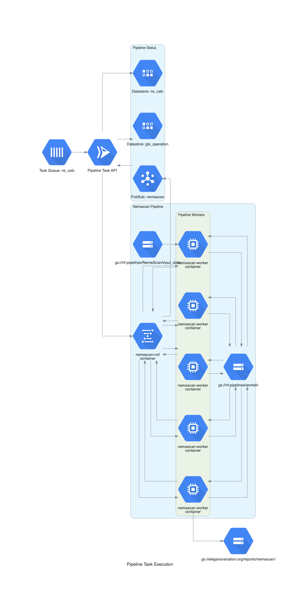

# CeNDR Lifesciences Pipeline Task Runner

## Removing cached files

make clean

## Setting up local environment for testing

make venv

## Running locally

make run

## Building a container for deployment in the cloud (staging environment)

make cloudbuild-stage

## Deploying all resources including the most recently built container in the cloud (staging environment)

make tf-plan-stage
make tf-apply-stage

## Architecture Diagram

